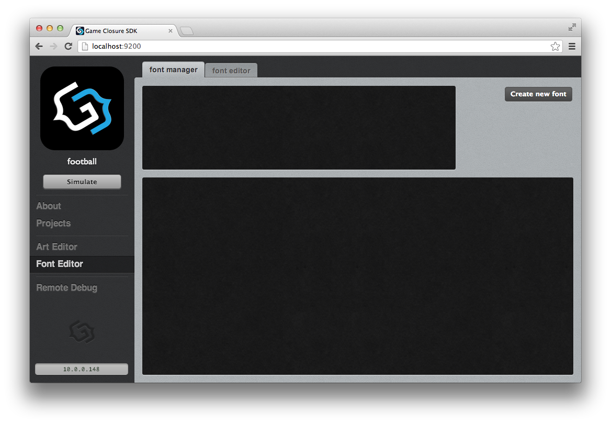
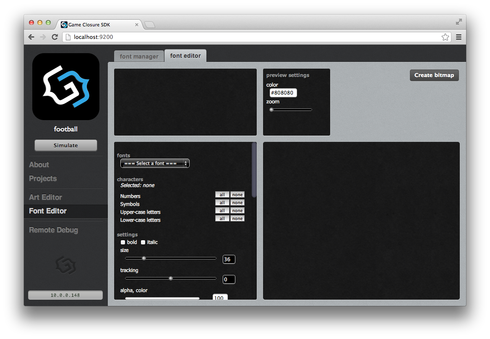
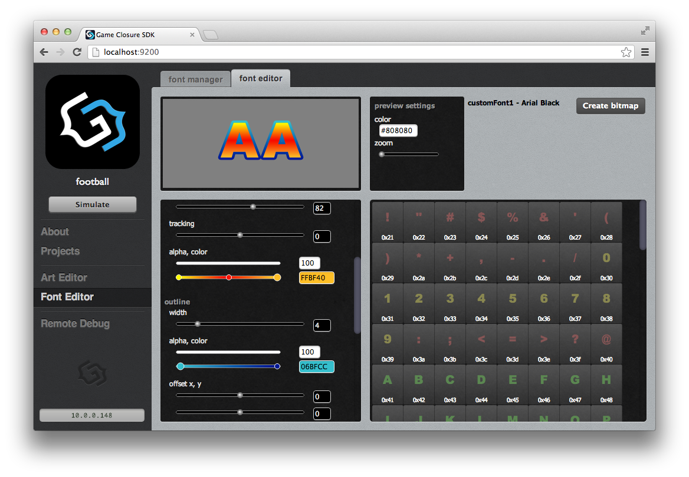
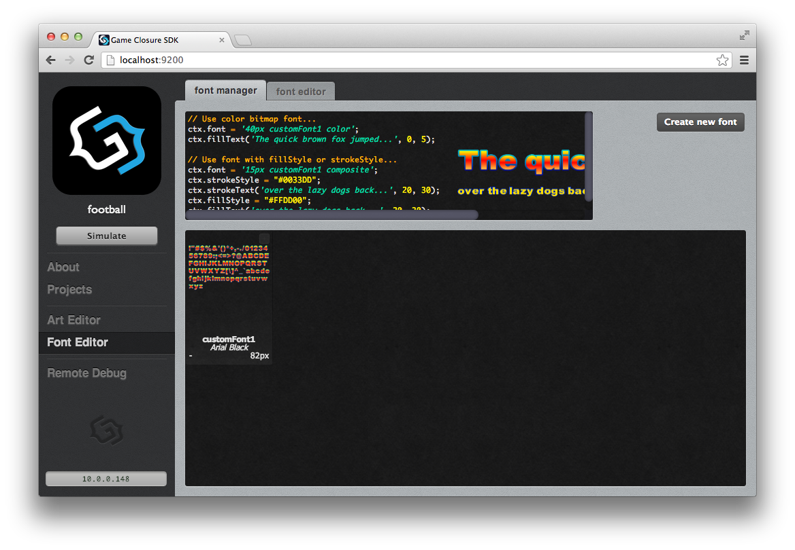
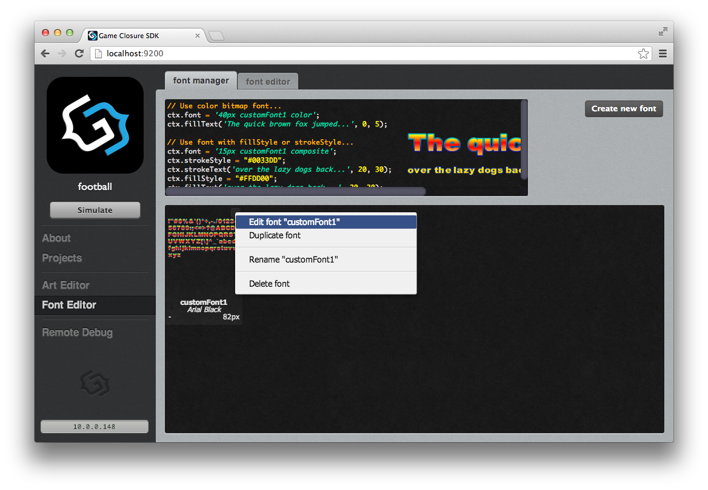

# The font editor tool

## Overview

The SDK offers several ways of displaying fonts. For basic fonts there's the option to use TTF fonts.
However if you need styling which goes beyond a color and an outline then you can use the font editor.

With the font editor you can create fonts with gradients, outlines, embossing, alpha gradiens, shadows, etc..

The font editor generates three different types of bitmaps: color, font and outline. Each type has one or
more bitmaps depending on the size of the font. If the characters don't fit in a 1024 by 1024 pixel bitmap then
the editor will keep creating bitmaps until all characters have a bitmap to be placed on.

Color fonts have all information needed to render and the color can't be changed, they will be rendered 
exactly as generated by the tool. These fonts can have all the fancy effects in them like gradients, outline,
alpha gradients, etc..

The composite font bitmaps are created both for the outline and the font itself. Composite font bitmaps are
generated white and a color is applied by setting the `strokeStyle` for the outline and the `fillStyle` for the
font on the context.

All loading of the bitmaps is handled by the SDK, you only have to create the font you like and use it from
your javascript code.

## Creating a bitmap font

After clicking on the `Font Editor` option in the left menu the font overview for the active project appears.
New projects don't have any bitmap fonts.

</img>

Click on the `Create new font` button to start making a new bitmap font.

</img>

There are a couple of options which you have to select to create a font:

:    1. `fonts` ---The font used to render the bitmap font
   2. `characters` ---The characters in the bitmap, you can select single characters but you can also select a group like `Numbers`, `Symbols`, etc..

</img>

The bars for the color and alpha settings allow you to add new points by clicking on them. If you click on a point
then the color or alpha value is displayed on the right side and can be changed by clicking on it or entering a new value.
A gradient point can be removed by dragging it of the bar.

## Managing fonts

When a font is created and the `font manager` tab is selected again then a thumbnail image of the font is displayed in the list.
A preview with a code fragment will be displayed if the thumbnail image is clicked.

</img>

The font editor uses the prefix `customFont` followed by the first unused number as a name, it's possible
to rename bitmap fonts from the `font manager` pane.

The right top of the font tile shows a small button, clicking it shows a menu with several options:

:    1. `Edit customFont1` ---Open the font editor with the previously selected options for this font
   2. `Duplicate font` ---Open the font editor with the settings of the selected font to create a new font
   3. `Rename "customFont1"` ---Change the name of the font
   4. `Delete font` ---Removes all settings and files which were generated for the font

</img>

## Using a bitmap font

The loading of the bitmaps for the fonts is handled automatically. The fonts can be used by setting the name 
in the context followed by the render method and calling `fillText` or `strokeText`. There are two render
methods: `color` and `composite`. If `composite` is selected then the `fillStyle` is applied when using `fillText`
and `strokeStyle` is applied when using `strokeText`.

The following code fragment shows how to render a bitmap font with the colors selected in the editor:
~~~
this.render = function(ctx) {
  ctx.font = "36px customFont1 color";
  ctx.textBaseline = "top";
  ctx.fillText("Hello world", 10, 10);
};
~~~

Here's how to display a font generated with the editor with a given fill and outline color:
~~~
this.render = function(ctx) {
  ctx.font = "36px customFont1 composite";
  ctx.strokeStyle = "#FFDD00";
  ctx.strokeText("Hello world", 5, 5);
  ctx.fillStyle = "#0088DD";
  ctx.fillText("Hello world", 5, 5);
};
~~~

