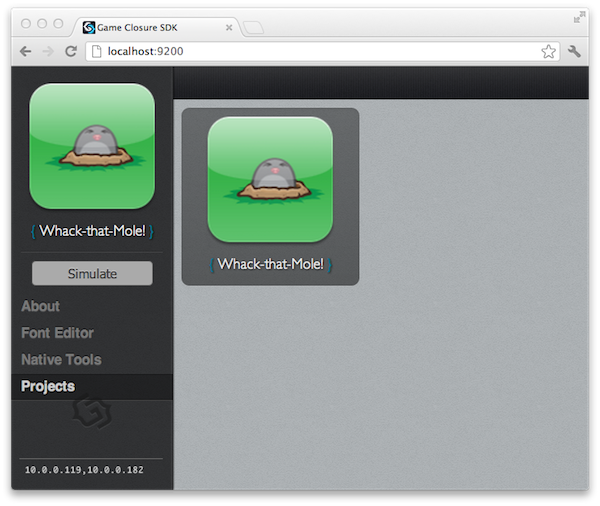

# Game Walk-Through

*Whack That Mole!* is a basic, non-trivial, game built using
the Game Closure DevKit. The [source code](https://github.com/gameclosure/whack-that-mole)
is available and in this guide we'll step through it
to see how the components of the Game Closure DevKit fit together.

This walk-through assumes that you have the Game Closure DevKit
up and running. See the [Quick Start Guide](../guide/quick-start.html)
for details on how to get set up.

## Game Install

Before we take a close look at the implementation details,
we need to download and install the game.

First, clone the git repository of the game from your terminal:

~~~
$ git clone git@github.com:gameclosure/whack-that-mole.git
~~~

You then must register the project with the basil
command-line utility before it will show up in the project
browser. You should only need to run this command once:

~~~
$ cd ./whack-that-mole
$ basil register
~~~

Now that the game is registered, you're ready to play! Just
run the basil project server from the command-line:

~~~
$ basil serve
~~~

This will start a server on your machine on port
9200. Navigate your web browser to `http://localhost:9200`
and you're greeted with the following screen:

First, we need to select our project: click on the
**Projects** link in the left nav and select the **Whack-that-Mole!** game:

With the game icon selected, click the **Simulate** button
to launch the game in a new web browser tab.

The game is now running in the browser simulator! On the
title screen, click the **Play** button to begin. The game
is simple enough, just whack the moles when they peak out of
their holes in the ground. After 20 seconds or so, the game
ends and your score is displayed. Then simply click anywhere
on the screen to return back to the title screen.

## Browser Debugging

One of the keys to a great developer experience is great
debugging tools. There has been a lot of effort put in to
the developer environment of the Game Closure DevKit so that
it's easy to get up and running, and easy to see how the
code in your game works. With your game running in the
browser, not only do you get access to all the great
development tools provided by the browser, but your speed of
development increases because your feedback loop is
quicker. You get to see how your game changes immediately
in the browser, instead of spending valuable development
time waiting to compile and upload code to a mobile device.

### UI Inspector

One of the nice tools we provide is the *UI Inspector*. This
lets the developer get a top-down look of the game's scene
graph, to see exactly how all the views fit together. You
can target a particular view by navigating through the menu
tree, or by simply hovering over a view in the
simulator. You can then inspect the properties of the selected view,
and even alter these properties right in the inspector. Since these effects will
be instantly seen in the game, you can make user interface
and game play adjustments instantaneously, rather than waiting
through a lengthy feedback loop of reloading the entire
browser page.

### Browser Debugging Tools

One of the great things about working with JavaScript is the
great debugging tools that modern web browsers have
built-in. In the Chrome browser, you can access the
developer tools by clicking the control settings icon in the
upper right corner, then **Tools** > **JavaScript Console**.
This will open up a console where you can type in JavaScript
commands to your game:

To access the JavaScript variables in your game's context
you'll need to switch from the `<top frame>` console frame 
to the game's frame `Simulator_0`, this option is selectable on the bottom
of the console window.

Once you're in the proper context, at the console type:

~~~
> GC.app.view
~~~

This will return a reference to the root node of the scene
graph. From there you can view and alter its properties, or
even traverse the view hierarchy and access any of its children.

### Class System

We'll be structuring this game in to multiple files using
our [class and module system](../api/utilities.html#import).
We will discuss the system throughout this document, but the
implementation details are available in the documentation.

## Project Structure

A game created with the Game Closure DevKit has this basic file structure:

~~~
.
├── manifest.json
├── sdk -> /path/to/devkit/sdk
├── resources/
└── src
    └── Application.js
~~~

There is the `manifest.json` file located in the project
directory which contains our project's configuration
options, the `src` directory containing our application
code, and the `resources` directory where the game assets are stored.

The game's manifest can contain any number of project
specific configuration options in JSON format. A typical,
minimal `manifest.json` file has a generated
application ID hash, a name, and perhaps the device orientation of
the game. This file is usually generated by basil, but can
be edited by hand. For example, this could be the
`manifest.json` file used by our game:

~~~
{
  "appID": "abcdefghijklmnopqrstuvwxyz012345",
  "shortName": "whackthatmole",
  "title": "Whack-that-Mole!",
  "supportedOrientations": [
    "portrait"
  ]
}
~~~

You can find a complete list of [manifest options](../guide/manifest.html)
in the documentation.

There is also an `sdk` directory which is actually a symlink to
the DevKit installed with basil. This is provided as a
convenience for navigating the DevKit JavaScript code to
see what's going on "under the hood".

The `resources` directory provides a place to store game
assets, like images and sound files.

The JavaScript code we'll develop for our game is located in
the `src` directory. The entry point for the game is
the `./src/Application.js` file, which defines an object that
inherits from the `GC.Application` class. This object has a number
of options that you can find in its [API documentation](../api/appengine.html).

## Game Flow

Before diving into the implementation details of *Whack-that-Mole!*,
let's take a top-down look at the application and get an
overview of how the game flows together.

First, the Game Closure DevKit is initialized and the
environment is set up for the user's application. The entry
point for the game is the `./src/Application.js` file in the
project's directory. This file initializes all of the game screens
and manages the events for moving between them.

The application uses a *View Stack* for pushing on---and popping
off---game screens. When the game is started, the
title screen is pushed onto the stack. This displays the
screen graphics and awaits user input to begin the game. This screen
is defined in the `./src/TitleScreen.js` file.

When the user taps the play button, the game play screen is then
pushed onto our screen stack. The game play screen is responsible for
setting up the game assets and interface, then starting,
playing, and ending the game. This is defined in the
`./src/GameScreen.js` file.

When the game ends, the user's score is displayed and the
game screen holds while we await user input to continue. Upon
receiving that tap, the game screen is popped off
the screen stack, revealing the title screen. The game returns to 
the title screen and, as before, awaits to be played again.

## Game Structure

The complete file structure of our project can be see here:

~~~
.
├── manifest.json
├── sdk -> /path/to/basil/sdk
├── resources
│   ├── images
│   │   ├── hole_back.png
│   │   ├── hole_front.png
│   │   ├── icon.png
│   │   ├── mole_hit.png
│   │   ├── mole_normal.png
│   │   └── title_screen.png
│   └── sounds
│       ├── effect
│       │   └── whack.mp3
│       └── music
│           └── levelmusic.mp3
└── src
    ├── Application.js
    ├── GameScreen.js
    ├── MoleHill.js
    ├── TitleScreen.js
    └── soundcontroller.js
~~~

The logic of our game is contained in the files located in
the `./src` directory, which we'll look at now.

### The Entry Point: Application.js

Once the Game Closure DevKit environment is initialized, the
game picks up in your project's `./src/Application.js`
file. In *Whack-that-Mole!*, this file is rather short, and its
purpose is to initialize the title screen and game screen and
handle events for directing the game flow.

~~~
/*
 * The main application file, your game code begins here.
 */

// devkit imports
import device;
import ui.StackView as StackView;
// user imports
import src.TitleScreen as TitleScreen;
import src.GameScreen as GameScreen;
import src.soundcontroller as soundcontroller;

/* Your application inherits from GC.Application, which is
 * exported and instantiated when the game is run.
 */
exports = Class(GC.Application, function () {

 /* Run after the engine is created and the scene graph is in
  * place, but before the resources have been loaded.
  */
  this.initUI = function () {
    var titlescreen = new TitleScreen(),
        gamescreen = new GameScreen();

    this.view.style.backgroundColor = '#30B040';

    //Add a new StackView to the root of the scene graph
    var rootView = new StackView({
      superview: this,
      x: device.width / 2 - 160,
      y: device.height / 2 - 240,
      width: 320,
      height: 480,
      clip: true,
      backgroundColor: '#37B34A'
    });

    rootView.push(titlescreen);

    var sound = soundcontroller.getSound();

   /* Listen for an event dispatched by the title screen when
    * the start button has been pressed. Hide the title screen,
    * show the game screen, then dispatch a custom event to the
    * game screen to start the game.
    */
    titlescreen.on('titlescreen:start', function () {
      sound.play('levelmusic');
      rootView.push(gamescreen);
      gamescreen.emit('app:start');
    });

   /* When the game screen has signalled that the game is over,
    * show the title screen so that the user may play the game again.
    */
    gamescreen.on('gamescreen:end', function () {
      sound.stop('levelmusic');
      rootView.pop();
    });
  };

 /* Executed after the asset resources have been loaded.
  * If there is a splash screen, it's removed.
  */
  this.launchUI = function () {};
});
~~~

At the top of this file, two modules from the DevKit and three
additional source files are imported in to our project using the 
[`import`](../api/utilities.html#import) statement:

~~~
// devkit imports
import device;
import ui.StackView as StackView;
// user imports
import src.TitleScreen as TitleScreen;
import src.GameScreen as GameScreen;
import src.soundcontroller as soundcontroller;
~~~

These files have been written as modules and are assigned to
variables within this file.

Note that this `Application.js` file is also a module, it's
a class that inherits from `GC.Application` using the
`Class` function (see [the Class docs](../api/utilities.html#class-name-superconstructor-constructor) for more info). This new class is then assigned to
the `exports` object, a predefined object within
each module file that is returned when another file
imports this one. When our application is instantiated, it's
assigned to the global property `GC.app`, which can be
accessed anywhere in your game code. Since you are only
going to have one application in your game, you can just
think of this as a singleton. Within the application's class
definition function, you can refer to it using the `this`
object. A working---bare-bones---`Application.js` file can
look like this:

The `device` module contains information about the physical
device running the application. We can use this to obtain
information about the browser window, or even a native
mobile application depending on where your game is running.
You can view a complete list of [device properties](../api/device.html)
in the documentation.

~~~
exports = Class(GC.Application, function () {
  // class definition goes here ...
  // this === GC.app //=> true
});
~~~

The `GC.Application` class is special in that it has two
callback functions, `initUI` and `launchUI`, that it checks
for and runs when ready---this is where we'll hook in our
main game code. The `initUI` function is run after the Game
Closure engine is created and the scene graph is
ready. When the `launchUI` function is called, the splash/loading
screen is removed if one is defined.

#### Creating the Screens

After our game screen classes have been imported at the top
of our file, we instantiate them in the `initUI`
function. This is when our game engine is ready.

~~~
var titlescreen = new TitleScreen(),
    gamescreen = new GameScreen();
~~~

We'll look in detail about how these screens are constructed
in the next couple of sections.

When the scene graph for the game engine is created, its
root node is stored at `GC.app.view`. Any View that is
attached as a child to this node, or its descendants, can be
rendered to the screen. The root view is a little special
because it's an instance of
[ui.StackView](../api/ui-stackview.html), which is a
*subclass* of [ui.View](../api/ui-view.html). It has
additional functionality for pushing and popping child views
and transitioning between them.

You can also see that there is some simple sound code in here,
but we'll look at that towards the end of this guide. The
`soundcontroller` module returns a [`AudioManager`](../api/audio.html) singleton,
which we use to play the level music when we transition to
the game screen.

#### Event Management

In the event handling code, we listen for the game start and
end events on our two screens and manage our root `StackView`:

~~~
titlescreen.on('titlescreen:start', function () {
  //...
  GC.app.view.push(gamescreen);
  gamescreen.emit('app:start');
});

gamescreen.on('gamescreen:end', function () {
  //...
  GC.app.view.pop();
});
~~~

When the event to start the game is received, the game
screen is *pushed* on to the `rootView` stack view. There is
no need to remove the title screen already in the stack, the
game screen is simply "on top" of it and becomes the visible
view of the application. By default, pushing another view to
the `StackView` has a side-scrolling animation transition,
this can be turned off. We'll look at the details of the
game's event flow in a moment as we step through the title screen.

 
### The Game Awaits: TitleScreen.js
 
With our application framework in place, let's see how
the title screen is constructed. The screen is an instance
of the `TitleScreen` class, defined in the
`./src/TitleScreen.js` file. It is instantiated once in
`./src/Application.js` and added to the root view where it
remains throughout the lifetime of the application.

#### Anatomy of a View
 
The view hierarchy structure of the `TitleScreen` class is
relatively simple. There is a singe background image that
fits the screen, and an "invisible" child view
placed over the portion of the background image designated
as the play button. This button will detect an input event, then
signal to the main application that the user is ready to
start the game. Since this is such a small class, we'll look
at the file in its entirety here, then break down it's component
pieces:

~~~
import device;
import ui.View;
import ui.ImageView;

exports = Class(ui.ImageView, function (supr) {
  this.init = function (opts) {
    opts = merge(opts, {
      x: 0,
      y: 0,
      image: "resources/images/title_screen.png"
    });

    supr(this, 'init', [opts]);
  };

  this.buildView = function () {
    var startbutton = new ui.View({
      superview: this,
      x: 58,
      y: 313,
      width: 200,
      height: 100
    });

    startbutton.on('InputSelect', bind(this, function () {
      this.emit('titlescreen:start');
    }));
  };
});
~~~

First, we need to import the classes and modules that are
used within this class:

~~~
import device;
import ui.View;
import ui.ImageView;
~~~

`ui.View` is a class used as the basic display object for
rendering elements to the screen. To do this, a view must be
attached to the game's scene graph (a hierarchy
of view nodes). Views have style properties which control
how they are rendered to the screen, they can emit and subscribe
to events, and they have methods for adding and removing their
subviews and superviews. The details of the `ui.View`
properties and methods can be found
[in the documentation](../api/ui-view.html), with examples uses.

`ui.ImageView` is a subclass of `ui.View`. Along with
the properties it inherits from the base View, `ImageView`
has additional methods for setting an image to be used
within a view. Check the [ImageView API](../api/ui-images.html) for more details.

Now that we have imported our dependencies, we can define
our `TitleScreen` class. Here we use the `Class` function to
define our screen module as a sub-class of the `ui.ImageView` type:

~~~
exports = Class(ui.ImageView, function (supr) {
  this.init = function (opts) {
    opts = merge(opts, {
      //...
    });

    supr(this, 'init', [opts]);
  };

  this.buildView = function () {
    //...
  };
});
~~~

Each class defined by the
[Class function](../api/utilities.html#class-name-superconstructor-constructor)
has an `init` method which is executed when a new object is
instantiated, or in this case when `new TitleScreen` is
called. Within this initialization example, the `merge`
utility function is used to consolidate the default options
set in the class with the options properties passed to the
constructor, you can see how this function works in the
[Utilities API](../api/utilities.html#merge-obj1-obj2-obj3). Then
we initialize the underlying superclass by calling the
`init` method of this superclass and passing it the merged
options object. Here's the complete `init` function:

~~~
this.init = function (opts) {
  opts = merge(opts, {
    x: 0,
    y: 0,
    image: "resources/images/title_screen.png"
  });

  supr(this, 'init', [opts]);
};
~~~

The `title_screen.png` image file is loaded as the `image` option for
`ui.ImageView`. 

The `supr` function is provided as an argument to the class
definition by the `Class` function. As parameters it
takes the object, a method name on the object to execute,
and an array of arguments to apply to this function. Since
`opts` is a single object, it's wrapped in a new array
before passing it to `supr`.

#### The Play Button

Each class that inherits from `ui.View` also contains a
`buildView` method. This function is executed by the DevKit
immediately before the view is first rendered to the
screen. Consequently, this is the preferred place to define
child views since it defers memory allocation until you
actually need the view. By defining them here, you can be
sure all parent views have already been initialized. This is
important if, for instance, you need to reference a parent
view's position and dimensions when creating your subview.

~~~
this.buildView = function () {
  var startbutton = new ui.View({
    superview: this,
    x: 58,
    y: 313,
    width: 200,
    height: 100
  });

  startbutton.on('InputSelect', bind(this, function () {
    this.emit('titlescreen:start');
  }));
};
~~~

For the title screen, we create our "invisible" start button
and position it exactly over the correct portion of the
background image. The view is attached as a child to the
instance of the `TitleScreen` by passing `this` as the
`superview` option. Then we attach an `InputSelect` listener
to capture user clicks and taps. Here we emit a title screen
start event, which we listen for in this view's parent, the
`Application.js` file. For more info on input events, see
[the input Event Docs](../api/ui-view.html#events).

#### Event Flow

You just saw how the start button captures user input and
propagates this to the main application. Here's an overview
of the entire event flow of the game. You'll see the rest of
these events later, but for now here's how the player is
moved through the game using these events:

After the application is created and the game screens are
set up, the player enters at the title screen. Upon clicking
the start button, the `'titlescreen:start'` event is emitted
and captured at the top-level of the application. From
there, the game play screen is added, the user plays the
game, and then the `'gamescreen:end'` event is emitted back
to the application. Here the application removes the game
screen, and the player is dropped back to the title screen
right where they began.

### The Game Begins: GameScreen.js

The `GameScreen` class is defined in the
`./src/GameScreen.js` file and is the longest of the
project. Fortunately, much of that code is for building its
child view hierarchy, a process that we already looked at
in detail in the previous section. Beyond setting up child
views and game assets, there are functions for defining the
flow for the player starting and playing the game, and then
the end game sequence that displays the score. You can view
the file in it's entirety [on GitHub](https://github.com/gameclosure/whack-that-mole/blob/master/src/GameScreen.js),
but we'll look at the important sections here.

#### Set up the screen

Like our previous files, we import the classes and modules
that are required for this file:

~~~
import animate;
import device;
import ui.View;
import ui.ImageView;
import ui.TextView;
import src.MoleHill as MoleHill;
~~~

Since you've already seen `ui.View`, `ui.ImageView`, and `device`,
let's look at the others.

You can probably guess what `ui.TextView` does, it's simply
a view that allows you to display text on the screen. This
is helpful for scores, labels, and anything else that people
read. In addition to the style properties for regular views, you
can configure font size and color for `TextViews`. For
a full list of `TextView` properties, check out [the API](../api/ui-text.html).

`animate` is [a module](../api/animate.html) used for
animating views, objects, and style properties. This is a
"tweening engine" used to interpolate between screen
positions. Most importantly, since it can be optimized for
native devices, you should favor this module over manual
calculations within the game loop. We'll look its usage and
syntax in more detail as we come across it.

The final import statement in this file is a little more interesting:

~~~
import src.MoleHill as MoleHill;
~~~

The class `src.MoleHill` is a reference to the
`./src/MoleHill.js` class located in our project directory. Besides
the classes and modules defined in the DevKit, user defined
classes and modules can be imported into the game. Here the
`as` command is used to alias the `src.MoleHill` to simply
the `MoleHill` object. You can use this for any
import statement but it's especially handy for user-defined classes
with long path names. For more information on the import command, see
[the docs](../api/utilities.html#import).

Like `TitleScreen`, the `GameScreen` class is
instantiated only once, in the
`Application.js` file. Its `init` function defines options
for its dimensions to match the device
dimensions, as well as setting a green background color that
will serve as our grass. We initialize our superclass
by passing in the options to the `supr` function.

A listener is attached for an `'app:start'` event which will
start the game. This is dispatched from the root of our
application, after the start button click event was handled,
and executes the `start_game_flow` function.

~~~
this.init = function (opts) {
  opts = merge(opts, {
    x: 0,
    y: 0,
    width: 320,
    height: 480,
    backgroundColor: '#37B34A'
  });

  supr(this, 'init', [opts]);

  this.on('app:start', bind(this, start_game_flow));

  this._scoreboard = new ui.TextView({
    superview: this,
    x: 0,
    y: 15,
    width: device.width,
    height: 50,
    autoSize: false,
    fontSize: 38,
    verticalAlign: 'middle',
    textAlign: 'center',
    multiline: false,
    color: '#fff'
  });
};
~~~

There is something curious about this `init`
function, we've included the creation of our score board `TextView`
here, something usually reserved for the 
`buildView` function. This is a consequence of *when* `buildView` is
executed and it's child view is created (before the view
first needs to be rendered to the screen), and *when* we
first need to reference it (on the `'app:start'` event when
`start_game_flow` is called). If the `_scoreboard` view was
placed in `buildView`, the event would be captured
*before* any child views would be created, so the `TextView`
reference would not be available and the call in
`start_game_flow` to `scoreboard.setText(...)` would
fail. Typically, all children are safely built in
`buildView`, but in cases like this, it's worth
understanding the order in which views are created, just in case
you have to handle special situations like this.

Aside from constructing our score board view a little
earlier than usual, the rest of the subview creation is done
in the standard `buildView` function:

~~~
this.buildView = function () {
  var x_offset = 5;
  var y_offset = 160;
  var y_pad = 25;
  var layout = [[1, 0, 1], [0, 1, 0], [1, 0, 1]];

  this._molehills = [];
    
  //loop over the layout grid, row then column  
  for (var row = 0, len = layout.length; row < len; row++) {
    for (var col = 0; col < len; col++) {
        //if there was a 1 in the grid, create a mole
      if (layout[row][col] !== 0) {
        var molehill = new MoleHill();
        molehill.style.x = x_offset + col * molehill.style.width;
        molehill.style.y = y_offset + row * (molehill.style.height + y_pad);
        this.addSubview(molehill);
        this._molehills.push(molehill);
                    
        //update score on hit event
        molehill.on('molehill:hit', bind(this, function () {
          if (game_on) {
            score = score + hit_value;
            this._scoreboard.setText(score.toString());
          }
        }));
      }
    }
  }

  this._countdown = new ui.TextView({
    superview: this._scoreboard,
    visible: false,
    x: 260,
    y: -5,
    width: 50,
    height: 50,
    fontSize: 24,
    color: '#fff',
    opacity: 0.7
  });
};
~~~

It's a little longer than some of our previous `buildView`
functions, but it's easily understood. The top of the function
defines the position and layout of the mole hills on the
device's screen. We then create a number of `MoleHill`
objects (five in this example), add them as a subview to
this `GameScreen` instance, and attach an event handler to
each one which updates the score on registering a hit. The
`MoleHill` class is defined in the file `./src/MoleHill.js`
and we'll look at that soon. Basically, it's a collection of
images that are composited to show mole poking his head out of its
hill, and their animation functions.

With the mole hills in place, all that's left to do is set
up the countdown `TextView`, this is attached to the score
board we already created in `init`.

#### Starting sequence

With the child views set, we can now step through
starting, playing, and ending the game. 

Within the `init` constructor, we add listener function to
handle the `'app:start'` event that was dispatched from the top-level
of our application. It then calls `start_game_flow` which
plays the introductory animation sequence, then starts the
game play by calling `play_game`:

~~~
function start_game_flow () {
  var that = this;

  animate(that._scoreboard).wait(1000)
    .then(function () {
      that._scoreboard.setText(text.READY);
    }).wait(1500).then(function () {
      that._scoreboard.setText(text.SET);
    }).wait(1500).then(function () {
      that._scoreboard.setText(text.GO);
      //start game ...
      game_on = true;
      play_game.call(that);
    });
}
~~~

The \"Ready, Set, Go!\" message is displayed sequentially,
with a brief pause between words. At the end of each pause,
the text of the score board is updated and another animation
step is added. In the final step, the game
is started by executing `play_game.call(that)`; we apply the
`that` object (which is just a reference to `this`) so the
proper context is referenced in the subsequent function.

#### Game play

With everything set up, there's not much to the actual game
play. It consists of setting up a few timers; the
`tick` function picks a random mole to animate out of its hole,
another timer to update the countdown `TextView` each
second, and then some timeouts for setting up and ending
the game:

~~~
function play_game () {
  var i = setInterval(bind(this, tick), mole_interval),
      j = setInterval(bind(this, update_countdown), 1000);

    //when the game is up reset all timers, flags and countdown
  setTimeout(bind(this, function () {
    game_on = false;
    clearInterval(i);
    clearInterval(j);
    setTimeout(bind(this, end_game_flow), mole_interval * 2);
    this._countdown.setText(":00");
  }), game_length);

  //Make countdown timer visible, remove start message if still there.
  setTimeout(bind(this, function () {
    this._scoreboard.setText(score.toString());
    this._countdown.style.visible = true;
  }), game_length * 0.25);

  //Running out of time! Set countdown timer red.
  setTimeout(bind(this, function () {
    this._countdown.updateOpts({color: '#CC0066'});
  }), game_length * 0.75);
}

function tick () {
    //choose a mole by random
  var len = this._molehills.length,
      molehill = this._molehills[Math.random() * len | 0];

    //choose another if it's already active
  while (molehill.activeMole) {
    molehill = this._molehills[Math.random() * len | 0];
  }
  molehill.showMole();
}

function update_countdown () {
  countdown_secs -= 1;
  this._countdown.setText(":" + (("00" + countdown_secs).slice(-2)));
}
~~~

#### Ending sequence

After the game timer is over, the game ends and the ending
animation sequence begins---this is coordinated in the
`end_game_flow` function. The end game sequence checks if a
new high score has been set, and displays a closing message
based on that. An ending animation is played by popping up
the mole and alternating between hit image states, giving
the appearance that he is laughing at you.

~~~
function end_game_flow () {
  var isHighScore = (score > high_score),
      end_msg = get_end_message(score, isHighScore);

  this._countdown.setText(''); //clear countdown text
  //resize scoreboard text to fit everything
  this._scoreboard.updateOpts({
    text: '',
    x: 10,
    fontSize: 17,
    verticalAlign: 'top',
    textAlign: 'left',
    multiline: true
  });

  //check for high-score and do appropriate animation
  if (isHighScore) {
    high_score = score;
    this._molehills.forEach(function (molehill) {
      molehill.endAnimation();
    });
  } else {
    var i = (this._molehills.length-1) / 2 | 0; //just center mole
    this._molehills[i].endAnimation(true);
  }

  this._scoreboard.setText(end_msg);
  //slight delay before allowing a tap reset
  setTimeout(bind(this, emit_endgame_event), 2000);
}
~~~

Once the new score board message is set and the mole
animation is underway, a two second timeout is created that
adds a one-time event handler to listen for the user to
touch the screen:

~~~
function emit_endgame_event () {
  this.once('InputSelect', function () {
    this.emit('gamescreen:end');
    reset_game.call(this);
  });
}
~~~

When the screen is clicked, the game is reset and a
`'gamescreen:end'` event is emitted and handled in the
top-level application. From there, this game screen is
pushed off the view stack, revealing the title screen
ready for the user to play again.

### An Important Asset: MoleHill.js

The `MoleHill` class is another larger class, and again we won't
look at it in complete detail since you've already seen how views
work. For a complete listing of the
`./src/MoleHill.js` file, you can browse it
[online](https://github.com/gameclosure/whack-that-mole/blob/master/src/MoleHill.js).

#### Aligning the components

At a high level, a single mole hill is a collection of
three image assets stacked one on top of the next: the back
of the mole hill, the mole, and the front of the mole
hill. By animating the mole up and down on the y-axis and giving it a
clipping rectangle to mask it out beyond certain dimensions,
the mole will appear like it's "jumping" out of the
ground, and ready to be whacked!

~~~
this.buildView = function () {
  var hole_back = new ui.ImageView({
    superview: this,
    image: hole_back_img,
    //...
  });

  this._inputview = new ui.View({
    superview: this,
    clip: true,
    //...
  });

  this._moleview = new ui.ImageView({
    superview: this._inputview,
    image: mole_normal_img,
    //...
  });

  var hole_front = new ui.ImageView({
    superview: this,
    canHandleEvents: false,
    image: hole_front_img,
    //...
  });

  //...

  this._inputview.on('InputSelect', bind(this, function () {
    if (this.activeInput) {
      sound.play('whack');
      this.emit('molehill:hit');
      this.hitMole();
    }
  }));
};
~~~

Here, you can visualize how the component `ImageView`'s are
stacked together to make a single mole hill:

Since the body of the mole extends below the front molehill
image, the illusion of the mole diving into the
ground will be ruined unless we can show *only* the section of
the mole's body that is above the ground line. This can be done
by creating a new `View` and using it as a
clipping mask. Just set the `clip` option on the view to
`true`, and any child views attached to it will display only
the regions *within* the boundaries of the clipping view. In
the above diagram, the clipping view for the mole is
represented in the middle layer as the square drawn on top of
the mole.

We're also going to use this clipping view as a button
region to test if a hit has been registered on a mole. Any tap within
its bounding area, when the mole is active, will count as a
hit and update the score. But, we have a problem. The view
used to capture user input is obscured by the
`ImageView` displaying the front of the mole hill, and therefore
any clicks on the screen area where the mole is located will be
captured by the `hole_front` view, and these will *not* propagate
to the `_inputview`, which is where we need to register the
event. We can avoid this by setting the `canHandleEvents`
option to `false` on the `hole_front` view which covers our
intended input view. This allows events to "pass through"
the view so the views positioned underneath will receive the input instead.

Also in the `buildView` function, an `Animator` object is
created that references the `_moleview` child, which is the
`ImageView` of the mole's body:

~~~
this._animator = animate(this._moleview);
~~~

This creates a reference to an animation object that we will
call over the course of the game. We could execute
`animate(this._moleview)` each time we need to animate a
property on the view, but that wouldn't be as
efficient. Having a reference to this object attached to the
view means we can access it whenever we need it and not have
to create a new `Animator` instance for each animation.

#### Animating the mole

Three animation sequences are defined on the `MoleHill`
class: the mole popping up out of its hole, the mole
lowering back in to its hole, and an ending animation which
raises the mole up slowly and makes him laugh at you. These
are defined in the following methods using the `Animator`
object we just created:

~~~
this.showMole = function () {
  if (this.activeMole === false) {
    this.activeMole = true;
    this.activeInput = true;

    this._animator.now({y: mole_up}, 500, animate.EASE_IN)
      .wait(1000).then(bind(this, function () {
        this.activeInput = false;
      })).then({y: mole_down}, 200, animate.EASE_OUT)
      .then(bind(this, function () {
        this.activeMole = false;
      }));
  }
};

this.hitMole = function () {
  if (this.activeMole && this.activeInput) {
    this.activeInput = false;

    this._animator.clear()
      .now((function () {
        this._moleview.setImage(mole_hit_img);
      }).bind(this))
        .then({y: mole_down}, 1500)
        .then(bind(this, function () {
          this._moleview.setImage(mole_normal_img);
          this.activeMole = false;
          this.activeInput = false;
      }));
    }
};

this.endAnimation = function () {
  this.activeInput = false;
  this._animator.then({y: mole_up}, 2000)
  .then(bind(this, function () {
    this._interval = setInterval(bind(this, function () {
      if (this._moleview.getImage() === mole_normal_img) {
        this._moleview.setImage(mole_hit_img);
      } else {
        this._moleview.setImage(mole_normal_img);
      }
    }), 100);
  }));
};
~~~

The `animate` function interpolates values on a JavaScript
object property, and if passed a `View` will interpolate the values
on its `style` property. This is provided as a convenience
since most likely these are the properties you'll want to
animate.

For an example, let's step through the animation sequence of
popping a mole out if its hole. The following is from the
`showMole` method:

~~~
this._animator.now({y: mole_up}, 500, animate.EASE_IN)
  .wait(1000).then(bind(this, function () {
    this.activeInput = false;
  })).then({y: mole_down}, 200, animate.EASE_OUT)
    .then(bind(this, function () {
      this.activeMole = false;
  }));
~~~

The first step here is the animator's call to `.now({y: mole_up}, 500, animate.EASE_IN)`,
which immediately operates on the `y` property on the
animator object, and is defined as the `this._moleview`
view. Because the subject of the animation is an instance of
a `View` class, we're actually operating on its `style.y`
property, or the vertical position of the mole image on the
screen. The `mole_up` variable, set to 5 at the top of the
file, is the offset relative to its parent view
`this._inputview`. The first part of this animation will
take half a second, or 500 milliseconds, and ease in to the
final position. When this completes, the mole will be
peeking his head out of the hole.

At this point, the second phase of the animation is run
`.wait(1000)`. This pauses the animation sequence
for one second before moving on to the next item in the
sequence. Visually, this makes the mole stand up for a moment before
darting back in to his hole. If the mole is tapped within
this time, a hit is registered and the user's score increases.

Now, the command `.then( ... )` is called. It's passed
a callback function which gets run immediately. The function
sets the `activeInput` property of the mole hill to `false`,
which means the mole is no longer eligible to receive hits. When
that action is completed, the animation moves on to the next
item in the sequence.

We now want the mole to dive back into its hole, 
so we issue the command `.then({y: mole_down}, 200, animate.EASE_OUT)`.
As we've seen, the `.then` function can be called in a multitude of ways.
Here we're passing it the same arguments as the previous
`.now()` call. This lowers the mole back down on the y-axis in 
200 milliseconds, easing out of its
starting position and stopping below the ground line of
the hill.

When the lowering animation is complete, we issue the final
command in the animation sequence: `.then( ... )` supplied
with a callback function to set the `activeMole` property of
the mole hill to `false`. The sequence has now finished.

### Sound

The sound is added to our game using a singleton
controller located in the file `./src/soundcontroller.js`:

~~~
import AudioManager;

exports.sound = null;

exports.getSound = function () {
  if (!exports.sound) {
    exports.sound = new AudioManager({
      path: 'resources/sounds',
      files: {
        levelmusic: {
          path: 'music',
          volume: 0.5,
          background: true,
          loop: true
        },
        whack: {
          path: 'effect',
          background: false
        }
      }
    });
  }
  return exports.sound;
};
~~~

Here we create a single `AudioManager`
object when the application is launched and return this object
whenever `getSound` is called throughout the game. The details of
loading and playing sounds can be found in [the API](../api/audio.html).

To see how sound is used in this game, we'll look back at
our `./src/Application.js` file and its `initUI` function:

~~~
this.initUI = function () {
  //...

  var sound = soundcontroller.getSound();

  //...

  titlescreen.on('titlescreen:start', function () {
    sound.play('levelmusic');
    GC.app.view.push(gamescreen);
    GC.app.emit('app:start');
  });

  gamescreen.on('gamescreen:end', function () {
    sound.stop('levelmusic');
    GC.app.view.pop();
  });
};
~~~

After the start button has been pressed, the
`titlescreen:start` event is captured and the handler plays
the background music for the level. The audio file will
continue playing throughout the duration of the game play,
and will loop if the clip runs to the end if specified in
the loading options for `levelmusic`, `loop: true`. This is
all set up when we create our sounds with `new AudioManager(...)` 
in `./src/soundcontroller.js`.

## Conclusion

*Whack-that-Mole!*, while relatively simple, is an
example of a complete, working game. Sometimes the easiest
way to learn an API is to see how the components fit
together. In this tutorial we've explored the overall flow
of multiple game screens, managed the events that indicate
our progress through these screen, set up image and sound
assets, and implemented the game play dynamics. These are
the types of things you'll need to do in any game.

From here you might want to start experimenting with
changing the assets or their properties in the game by using
the UI Inspector in the browser simulator, or just by
changing values in the project code and
re-freshing. Alternately you could create some simple game
screens and manage the flow between them by capturing and
handling events. With this skeleton in place you can flesh
out any game flow, and even use this as the foundation to
build a game entirely your own!
