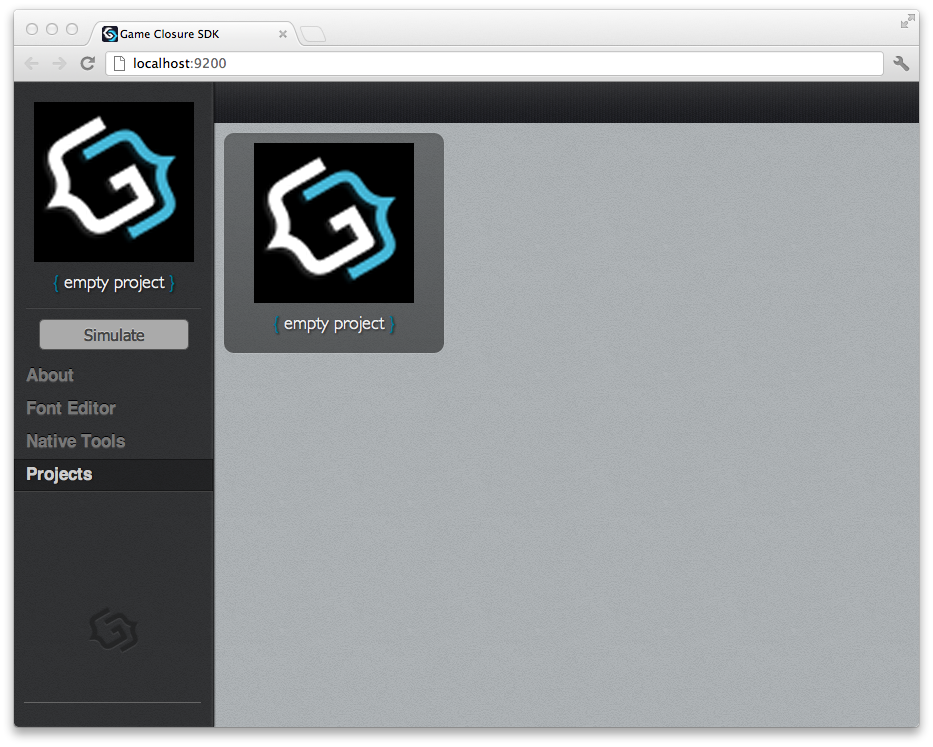
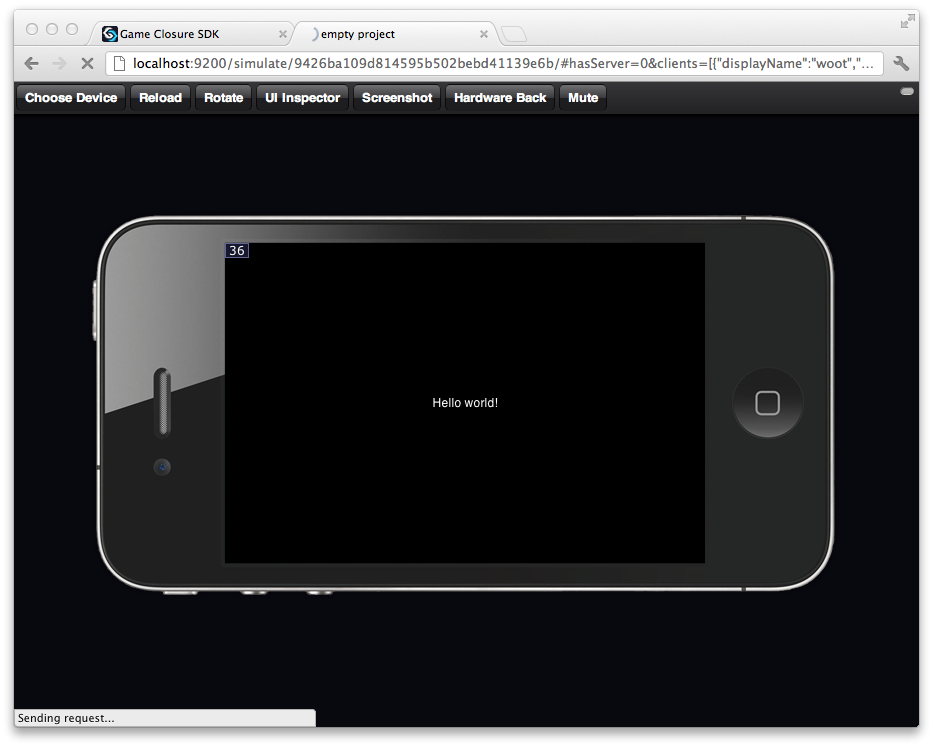
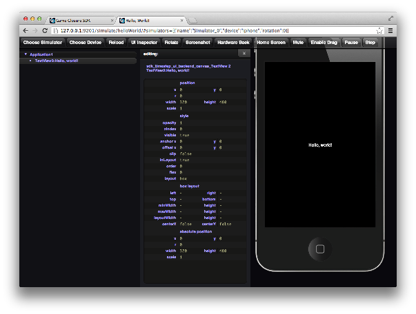
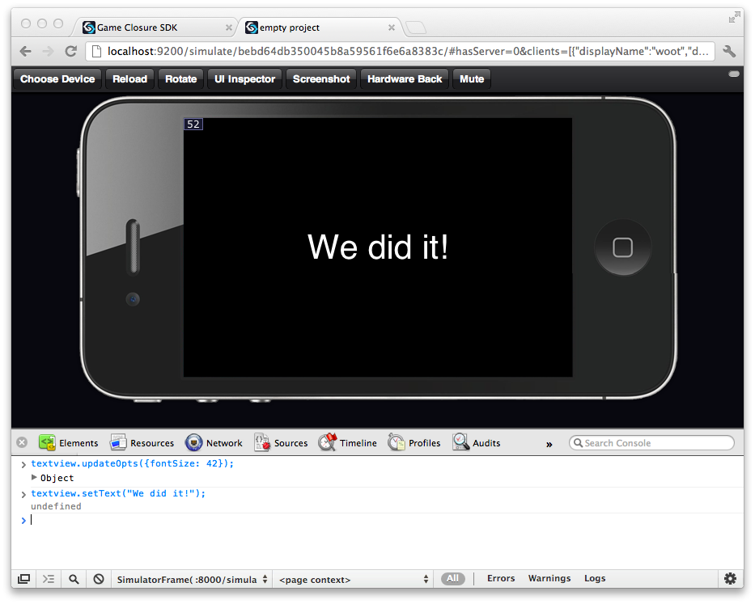

# Getting Started

## Getting the SDK

### Prerequisites

* [Git](http://git-scm.com) (> 1.7.10)
* [Node.js](http://nodejs.org) (> 0.8)
* [Java JRE](http://www.oracle.com/technetwork/java/javase/downloads/index.html) (included with installer)
* [Chrome](www.google.com/chrome) (what we test against)

### Download the source and install

~~~
$ git clone git@github.com:gameclosure/sdk.git
$ cd sdk
$ ./install.sh
~~~

This installs the command-line program `basil` which is used
create and serve projects. To see a list of basil commands,
simply run it in your terminal without any arguments:

~~~
$ basil
~~~

This will print out a list of basil commands. You can get
help for a particular command  by appending an `-h` option,
for example:

~~~
$ basil init -h
~~~

If you're getting permission errors when installing to the
`/usr/local` directory, try running this command:

~~~
$ sudo chown -R $(whoami) /usr/local
~~~

## Create a new project

With `basil` installed, you're ready to create a new
project! Switch to the directory where you want the new
project directory to reside, then run: 

~~~
$ basil init hello-world
~~~

Great! By default, basil generates a simple "Hello, world!"
template for your project. Now you can switch to the new
project's directory and serve the application:

~~~
$ cd ./hello-world
$ basil serve
~~~

By default, basil starts a server on your machine at
`http://localhost:9200`, to access the web interface for the
project, simply direct your web browser to this address. If you'd
like to specify a different port for your application, just
pass it as a `-p` option:

~~~
$ basil serve -p 8080
~~~

With the application server running, in your web browser
click the bottom tab named 'Projects' and select your 'empty
project' from the project list.

Now launch the simulator for your project by clicking the 'Simulate' button.

Your first application running in the browser, pretty cool,
right? This view gives you an idea of how it will look on a
mobile device, but remember, we're still in a web browser
which means we can interact with it, and debug it, using all
the great tools we're used to for web development.

If you're working on a project that wasn't created with
`basil init`, you'll need to register the project before it
is available in the web interface:

~~~
$ cd ./anotherproject
$ basil register
~~~

Now if you run `basil serve` you'll see the new project in
the web interface.

## Project Structure

~~~
project
  |--manifest.json (project information)
  |--src/
  |   |-Application.js (project entry point)
  |--resources/ (empty)
  |--sdk/ (symlink)
  |--build/ (generated when run)
~~~

Application.js:

~~~
import ui.TextView as TextView;

exports = Class(GC.Application, function() {

  this._settings = {
    logsEnabled: window.DEV_MODE,
    showFPS: window.DEV_MODE,
    clearEachFrame: true,
    alwaysRepaint: true,
    preload: []
  };

  this.initUI = function() {
    var textview = new TextView({
      superview: this.view,
      text: "Hello, world!",
      color: "white"
    });
  };

  this.launchUI = function () {};
});
~~~

## Inspecting and Debugging

Click on 'UI Inspector' to view the scene graph hierarchy.

In the view inspector you can see that there is a `TextView`
in the hierarchy named `'TextView2:Hello, world!'`

Using the [Chrome](http://www.google.com/chrome) web
browser, open up the JavaScript debugging console by
clicking the settings icon, then "Tools > JavaScript
Console." In this pane you can view all of the debugging
logs from the application and any JavaScript errors. You can
set breakpoints in your application just like a regular
JavaScript web application; for more information about using
the Chrome debugger, see the documentation for the
[Chrome Developer Tools](https://developers.google.com/chrome-developer-tools/docs/overview).

In the bottom of the console panel, switch the context of
the JavaScript REPL from `<top frame>` to
`<SimulatorFrame>`. Now you can access the variables of your
application directly, provide you are in the correct
scope. For instance, entering `GC.app` will return the
instance of your application.

Let's say we wanted to change the "Hello, world!" text while
the application is running. From looking at the UI Inspector
we know our lone TextView is a child of the main application
view, so we can grab a reference to it by reaching down the
view hierarchy:

~~~
var textview = GC.app.view.getSubviews()[0]; //select the first child view
~~~

As mentioned, `GC.app` is an instance of the application
defined in our project's `src/Application.js`
file. `GC.app.view` is the root of the scene graph, views
attached to this view hierarchy will be rendered to the screen.

The `getSubviews` method returns an array containing its
children, here we simply take the first (and only object) in
this collection.

With a reference to the text object we can use its API to
change the text to something else:

~~~
textview.updateOpts({fontSize: 42});
textview.setText("We did it!");
~~~

Notice how you can see the changes instantly in your
browser, this makes the coding-debugging feedback loop tight
and developer friendly.

Of course, if you want to persist this change, you'll need to edit the file.
