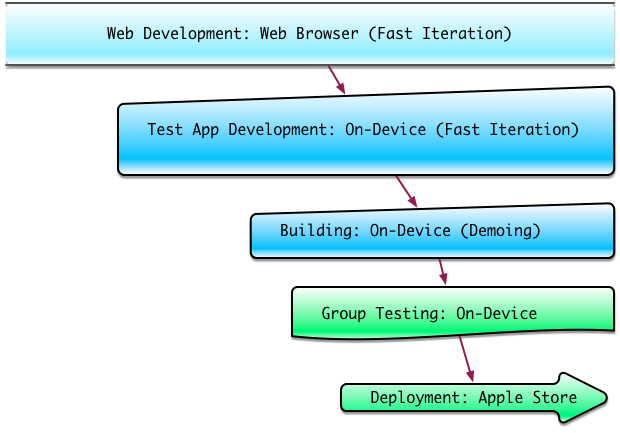

# Stages of iOS Development

## Overview

The iPhone and iPad mobile platform is immensely popular, and you can use the Game Closure SDK to target your HTML5 games to run smoothly on these mobile devices.  This is a high-level view of the progression for iOS game development using the Game Closure SDK.

For iOS development you will need to get an Apple Developer account, which Apple  $99/year.  This gives you access to Apple's Developer web portal, which allows you to manage provisioning profiles.  For more detail, follow the links below.

* Based on what stage of development your game is in, you may consider different types of builds:

</img>

### 1. Web Development

Test your code, art, and sound assets entirely in a web browser simulating a mobile device.  Quickly iterate using the Game Closure SDK web interface without doing any setup required for building on the mobile device.

Investigate coding errors, step through running code, pause execution, and inspect code objects using the Chrome built-in Web Inspector as with normal HTML5 game development.  Improve performance by finding code hot-spots with the CPU Profiler to target optimization.  Hunt down memory leaks using the Heap Profiler to identify object pile-ups.

</img>

For more information see the [basic SDK guides](../guide/quick-start.html).

### 2. Test App Development

Test your game code live on the device with the [Game Closure Test App](./test_app.html).  The test app will allow you to quickly test your game on a device without having to recompile and install a new application every time you make a change. Simply connect your device to the GC SDK server hosted on your computer, and begin testing your game as seemlessly as testing with the Game Closure web interface on your computer.  Again, for more information on how to get started with the Game Closure Test App, [look here](./test_app.html).

The same Chrome [Web Inspector interface](./ios-remote-debug.html) may be used to investigate coding errors on the mobile device from the comfort of your computer.

### 3. Building

Use the command-line tools from the Game Closure SDK to [build your game code](./ios-build.html) into an Xcode project.  The full list of command-line arguments can be brought up by running `basil build native-ios --help`.

</img>

Build your game to a device connected via an Apple USB cable.  Note that the iPhone 4 and 5 use different data cables.  Using the SDK build tools, you will create an Xcode project containing your code, art, splash screens, icons, and sound assets.  Console logs will be visible in Xcode while it is running.

</img>

At this stage you may test your in-app purchases using an Apple test account created through the Apple Developer website.

At this stage the mobile device no longer needs to be tethered to your computer and you can show off your game!

### 4. Group Testing

Build your game to an IPA file that can be distributed using [TestFlight](http://testflightapp.com) if you so choose.  Testers signed up with TestFlight can use your app all over the world on their mobile Apple devices.

### 5. Deployment

The same IPA file use for group testing will be uploaded to the Apple Store for release.  Please see our [iOS build guide](./ios-build.html) on how to create a .IPA file for release (or for testing).