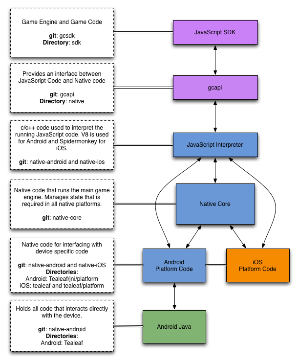

# Native Stack Overview

The following document provides a brief overview of how the
Game Closure stack interacts with native code.  Several
layers are required to have JavaScript, C, C++, Java, and
Objective-C++ communicate with each other.  Additionally,
the design allows for large amounts of code to be shared
between Android and iOS.

## Overview

The following diagram shows the flow of data/function calls
between the various components of the Game Closure DevKit
native stack. Blocks in purple use JavaScript, those in
blue use C and C++, those in green use Java, and those in
orange use Objective-C++.

<figure>
</img>
<figcaption>Native Stack Diagram.</figcaption>
</figure>

## Components

This section briefly explains the focus of each component of
the DevKit and describes some of the important directories
within them. Additionally the git repository for each
component is included for reference.

### Game Closure DevKit / Game Code

* **git**: [devkit](https://github.com/gameclosure/devkit)
* **language**: JavaScript
* **directories**:
	- **src**: Contains the source of the code used to build the basil tool.
	- **lib**: Contains the source code for the Game Closure DevKit components.

The JavaScript code for the Game Closure DevKit and running
game code. The code at this level is platform independent
and runs the same on both web browsers and mobile
devices. When running on a native device, this code is run
by the V8 interpreter on Android and Spidermonkey on iOS.

### GC API

* **git**: [gcapi](https://github.com/gameclosure/gcapi)
* **language**: JavaScript
* **directories:**
	- **native**: This holds the js code used to communicate to and from native  

This layer provides the backend implementations for the
DevKit JavaScript layer. It provides platform-specific code
allowing a JavaScript game to communicate with the browser
or mobile device. When running on a native mobile phone
this layer acts as a bridge from JavaScript to native code
through the JavaScript interpreter. This code should be
considered as a private API that should generally not be
accessed directly by game code.

### JavaScript Interpreter

* **git**: [native-android](https://github.com/gameclosure/native-android), [native-ios](https://github.com/gameclosure/native-ios)
* **language**: C++
* **directories:**
	- **android:Tealeaf/jni/js**: Directory containing the code to interface with the V8 interpreter.  
	- **ios:tealeaf/js**: Directory containing the code to interface with the Spidermonkey interpreter.

This is the native layer that interprets all the JavaScript
code in the project. When running in native on iOS the
Spidermonkey interpreter is used, whereas the V8 interpreter
is used on Android. In addition to running the JavaScript
code, it provides a bridge between the js-api layer and the
Native Core/Platform layers.

### Core

* **git**: [native-core](https://github.com/gameclosure/native-core)
* **language**: C/C++
**directories:**
	- **platform**: Contains header files that are implemented differently per native platform.  
	- **timestep**: Directory containing code dealing specifically with the timestep game engine.

Native accelerated components of the Game Closure DevKit. This
portion of the code manages state and functions that are
shared between all native platforms. It provides OpenGL
rendering and other native functions to keep the JavaScript
games running smoothly.

### Platform

* **git**: [native-android](https://github.com/gameclosure/native-android), [native-ios](https://github.com/gameclosure/native-ios)  
* **language**: C++, Objective C++
* **directories:**
	- **android: Tealeaf/jni/platform**: Directory containing code to interface between Android Java code, native code, and native core.
	- **iOS: tealeaf/platform**: Directory containing code to interface between Objective-C code and native core.

Code to bridge the native core and the js-api with device
specific code. On android this code is in C++ where as on
iOS it is in Objective-C.

### Android/Java

* **git**: [native-android](https://github.com/gameclosure/native-android)   
* **language**: Java  

Java code used to directly communicate with the Android OS
and other device features.

## Moving Around the Stack

The following is a brief overview on moving between the
various regions in the DevKit stack. These boundaries exist
because of the need to communicate between various
programming languages and because they allow code reuse
between different platforms.

### Game Closure DevKit to/from GC API

Moving from the Game Closure DevKit requires calling JavaScript
functions that live within the native folder of
gcapi. Since the Game Closure DevKit makes the correct calls to
gcapi behind the scenes the user does not need to know
which platform their code will be running on.

### GC API to/from Core or Platform through the JavaScript Interpreter
	
From within native code several JavaScript objects are
created and added to the single object `NATIVE`. This global
object in JavaScript provides functions that allow moving
from JavaScript to C and back. Native code can also
use the interpreter to make calls other functions that live
inside of JavaScript.

### Core to/from Platform

Using code defined in platform headers, calls can be made
into platform code so that it can be processed by the
device. By keeping the headers separate from the definition
the interface in core can be kept the same with different
implementations per platform. For android the platform files
are written in c++, whereas on iOS they are written in
Objective c.

### Platform to/from Java Code (Android Only)

Often code needs to be passed back to Java to interact
directly with Android OS features. In Android, this is done
using JNI calls which allow code to call from Java to C++
and C++ to Java. Within the Android platform code the
`native_shim.cpp` is an important file in this process.

## Example: Playing a Sound

One feature that requires touching all parts of the DevKit is
sound loading. This example shows how a sound is loaded if
the user tries to play an unloaded sound from JavaScript
when running on a native Android device.

1. **[timestep/src/AudioManager.js](https://github.com/gameclosure/timestep/blob/master/src/AudioManager.js)**:
First a call is made in JavaScript to `audiomanager.play`
which tries to play the required sound and we assume for
this example it has not yet been loaded. Since we are
running on a native device this means a call is made to
`HTML5API.js` to start the loading process.

2. **[timestep/src/ui/backend/sound/HTML5API.js](https://github.com/gameclosure/timestep/blob/master/src/ui/backend/sound/HTML5API.js)**:
This file represents an API for playing named sounds. In our
example it will use the `Audio.js` class in native to try
and play the sound.

3. **[gcapi/src/native/Audio.js](https://github.com/gameclosure/gcapi/tree/master/src/native/Audio.js)**:
Since the sound that is trying to be played has not yet been
loaded it will be loaded by making a call to
`Native.sound.loundSound`. This is a function that is
created from native code and acts a bridge between
JavaScript and C.

4. **[native-android/TeaLeaf/jni/js/js_sound.cpp](https://github.com/gameclosure/native-android/tree/master/TeaLeaf/jni/js/js_sound.cpp)**:
This file contains the function `defLoadSound` which is ran
when `Native.sound.loundSound` is called from
JavaScript. This function hands the load request to
`sound_manager.cpp` in platform by calling
`sound_manager_load_sound` so that sound can be handled
differently on iOS and Android.

5. **[native-android/TeaLeaf/jni/platform/sound_manager.cpp](https://github.com/gameclosure/native-android/tree/master/TeaLeaf/jni/platform/sound_manager.cpp)**:
Within this file a JNI call into java is made to `loadSound`
in `NativeShim.java`.

6. **[NativeShim.java](https://github.com/gameclosure/native-android/tree/master/TeaLeaf/src/com/tealeaf/NativeShim.java)**:
Within this file the sound being requested to load is placed
on the sound queue by calling `SoundQueue.loadSound` which
is processed in `SoundQueue.java`.

7. **[SoundQueue.java](https://github.com/gameclosure/native-android/tree/master/TeaLeaf/src/com/tealeaf/SoundQueue.java)**:
Within this file the `run` function is ran on its own thread
and it continually looks for events on the sound queue to
process and will begin processing the newly added load
event. The sound will be given to an instance of
`SoundManager` to be loaded by calling
`soundManager.loadSound`.

8. **[SoundManager.java](https://github.com/gameclosure/native-android/tree/master/TeaLeaf/src/com/tealeaf/SoundManager.java)**:
This is the file where sounds are actually loaded from the
app or url. Within this file another `run` function exists
and is also ran on its own thread. The function runs
continuously and checks for new sounds to load. Once the
sound is loaded it adds a sound loaded event to
`EventQueue`.

9. **[EventQueue.java](https://github.com/gameclosure/native-android/tree/master/TeaLeaf/src/com/tealeaf/EventQueue.java)**:
EventQueue holds a list of events that are to be sent to
JavaScript. These events are added to the queue by calling
`pushEvent` and are dispatched from the GLThread in Android
in `TeaLeafGLSurfaceView.java`.

10. **[TeaLeafGLSurfaceView.java](https://github.com/gameclosure/native-android/tree/master/TeaLeaf/src/com/tealeaf/TeaLeafGLSurfaceView.java)**:
This file contains code that needs to be run on the main GL
thread. In our case, all of the JavaScript engine code is
also run on this thread. Before every frame is drawn the
`dispatchEvents` function is called on `EventQueue` to send
all events to native code through `NativeShim`.

11. **[NativeShim.java](https://github.com/gameclosure/native-android/tree/master/TeaLeaf/src/com/tealeaf/NativeShim.java)**:
`dispatchEvents` is declared in NativeShim.java and is
called to dispatch the events to native code. The function
is marked as native and is defined within the file
`native_shim.cpp`.

12. **[native-android/TeaLeaf/jni/platform/native_shim.cpp](https://github.com/gameclosure/native-android/tree/master/TeaLeaf/jni/platform/native_shim.cpp)**:
The `dispatchEvents` function from `NativeShim.java` is
declared as `Java_com_tealeaf_NativeShim_dispatchEvents`
within the native_shim. This c function is used to pass each
event on the list to native core by calling
`core_dispatch_event`.

13. **[native-core/events.c](https://github.com/gameclosure/native-core/blob/master/events.c)**:
The `core_dispatch_event` function defined in `events.c`
takes each event and makes a call to `js_dispatch_event`
which dispatches the event to JavaScript.

14. **[native-android/TeaLeaf/jni/js/js_events.cpp](https://github.com/gameclosure/native-android/tree/master/TeaLeaf/jni/js/js_events.cpp)**:
The `js_dispatch_event` function defined in this file makes
calls using the V8 JavaScript Interpreter in order to get
the events back to JavaScript. The events are dispatched
using the `NATIVE.events.dispatchEvent` which lives on the
`NATIVE` object in JavaScript.

15. **[gcapi/src/native/events.js](https://github.com/gameclosure/gcapi/tree/master/src/native/events.js)**:
The call from native code ends up in the `events.js` file
which eventually sends the event to `soundLoading.js`.

16. **[gcapi/src/native/soundLoading.js](https://github.com/gameclosure/gcapi/tree/master/src/native/soundLoading.js)**:
Finally, the event makes it to the listener that was
registered from with `soundLoading.js`. This function takes
the sound event and calls the `onLoad` handler associated with
it.

While there may seem to be a lot of steps to loading a sound, the separation of concerns is important for maintaining a stable system that allows for code reuse.
