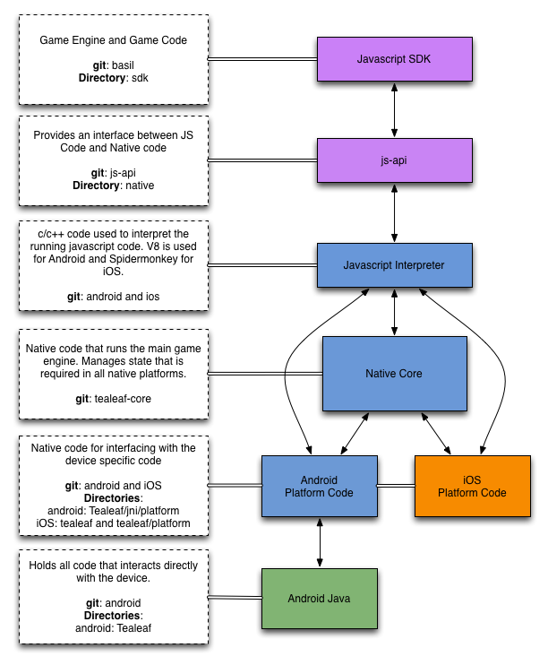

#Native Stack
The wonderful Game Closure Native Stack

##Graphic Overview

##Descriptions  
####JS SDK / Game Code
**git**: basil  
**language**: Javascript  
The javascript code for the Game Closure SDK and running game code. This code is run by the V8 interpreter on android and Spidermonkey on iOS.  
**directories:**  

- **addons**: Contains all sdk addons  
- …May need a lot of explanation here.

####JS Addon-Native
**git**: addon-native   
**language**: Javascript  
**description**: This javascript code acts as a bridge between javascript and native code. This code should be considered as a private api that should generally not be accessed directly by game code.  
**directories:**

- **lib/runtimeNative**: This holds the js code used to communicate to and from native  
- **targets**: This holds the js code used to build native applications

####JS Interpreter
**git**: android, ios  
**language**: c++  
**description**: This is the native layer that interprets all the javascript code in the project. It also provides the bridge between javascript and native code.  
**directories:**

- **android:Tealeaf/jni/js**: Directory containing the code to interface with the V8 interpreter.  
- **ios:tealeaf/js**: Directory containing the code to interface with the Spidermonkey interpreter.

####Core
**git**: tealeaf-core  
**language**: c/c++  
**description**: Natively accelerated game engine written in c and c++.  
**directories:**

- **platform**: Contains header files that are implemented differently per native platform.  
- **timestep**: Directory containing code dealing specifically with the timestep game engine.

####Platform
**git**: android, ios  
**language**: c++, objective c  
**description**: Code to bridge the native core with device specific code. On android this code is in c++ where as on iOS it is in objective c.  
**directories:**

- **android:Tealeaf/jni/platform**: Directory containing code to interface between Android Java code, native code, and native core.
- **iOS: tealeaf/platform**: Directory containing code to interface between Objective c code, native code, and native core.

####Device
**git**: android, ios  
**language**: Java, objective c  
**description**: Code in the device language (Android: Java, iOS: Objective C).  

##Moving Between Regions

####JS SDK to/from Addon-Native
Moving from the JS SDK requires calling javascript functions that live within addon-native.

####JS Addon-Native to/from Core or Platform through the JS Interpreter
Functions within addon-native make calls on objects created from core that allow functions to call into native code.

####Core to/from Platform
Using code defined in platform headers, calls can be made into platform code so that it can be processed by the device.

####Platform to/from Device Code
Often code needs to be passed back to the devices language. In Android this is done using jni calls. In iOS no special calls are required.

