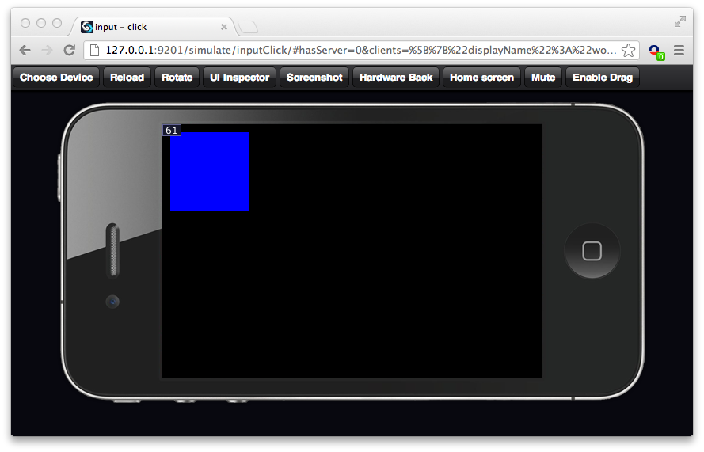

## Handling click events

This file demonstrates how to handle click events, when the view is clicked the color changes.

~~~
import ui.View as View;
~~~

Create a view which changes color when clicked:

~~~
var ClickBox = Class(View, function(supr) {
    this.init = function(opts) {
        opts = merge(opts, {backgroundColor: "#FF0000"});
        this._index = 1;

        supr(this, "init", [opts]);
    };

    this.onInputSelect = function() {
~~~

Use indices 0, 1, 0, 1, 0, 1, etc...

~~~
        this._index = (this._index + 1) & 1;
~~~

Change the background color of this view

~~~
        this.updateOpts({backgroundColor: ["#0000FF", "#FF0000"][this._index]});
    };
});
~~~

Create an application with the clickable view:

~~~
exports = Class(GC.Application, function() {

    this._settings = {
        logsEnabled: window.DEV_MODE,
        showFPS: window.DEV_MODE,
        clearEachFrame: true,
        alwaysRepaint: true,
        preload: []
    };
~~~

Create a new instance of the ClickBox view with the applications view as superview:

~~~
    this.initUI = function() {
        new ClickBox({
            superview: this.view,
            x: 10,
            y: 10,
            width: 100,
            height: 100
        });
    };

    this.launchUI = function () {};
});
~~~

The output should look like this screenshot:

After clicking on the red rectangle the screen should look like this:

