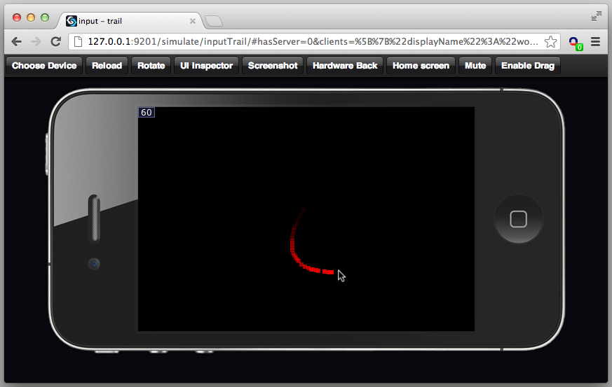

## Create a trail

This demo shows how to create a trail behind the mouse when clicking and dragging.

Import the view class:
~~~
import ui.View as View;
~~~

Create a view which fades out over a time of 500ms...

~~~
var TrailBox = Class(View, function(supr) {
    this.init = function(opts) {
        supr(this, "init", [merge(opts, {width: 6, height: 6, backgroundColor: "#FF0000"})]);
~~~

Set the start time:

~~~
        this._dt = 0;
    };
~~~

Reset the view

~~~
    this.reset = function(opts) {
~~~

Set the start time

~~~
        this._dt = 0;
~~~

Because opts contains a superview this view is added to the superview!

~~~
        this.updateOpts(opts);
	};
~~~

This function is called every frame and after 500ms removes the view

~~~
    this._tick = function(dt) {
        this._dt += dt;
        if (this._dt > 500) {
~~~

Remove this view from the superview

~~~
            this.removeFromSuperview();
        } else {
~~~

Fade out...

~~~
            this.updateOpts({opacity: 1 - this._dt / 500});
        }
    };
});
~~~

Create an application, set the default settings:
~~~
exports = Class(GC.Application, function() {

    this._settings = {
        logsEnabled: window.DEV_MODE,
        showFPS: window.DEV_MODE,
        clearEachFrame: true,
        alwaysRepaint: true,
        preload: []
    };
~~~

Create a circular buffer and the index in the buffer:

~~~
    this.initUI = function() {
        this._trail = [];
        this._index = 0;
~~~

Listen to move events:

~~~
        this.view.onInputMove = bind(this, "onInputMove");
    };
~~~

This function is called when the user drags. The second parameter contains the drag coordinates:
~~~
    this.onInputMove = function(evt, pt) {
        var opts = {superview: this.view, x: pt.x - 3, y: pt.y - 3};

        if (this._trail.length < 64) {
~~~

Add a new view to the circular buffer

~~~
            this._trail.push(new TrailBox(opts));
        } else {
            this._trail[this._index].reset(opts);
~~~

Next value of the circular buffer:

~~~
            this._index = (this._index + 1) & 63;
        }
    };

    this.launchUI = function () {};
});
~~~

When you click (or touch) and drag the screen should look like this:

